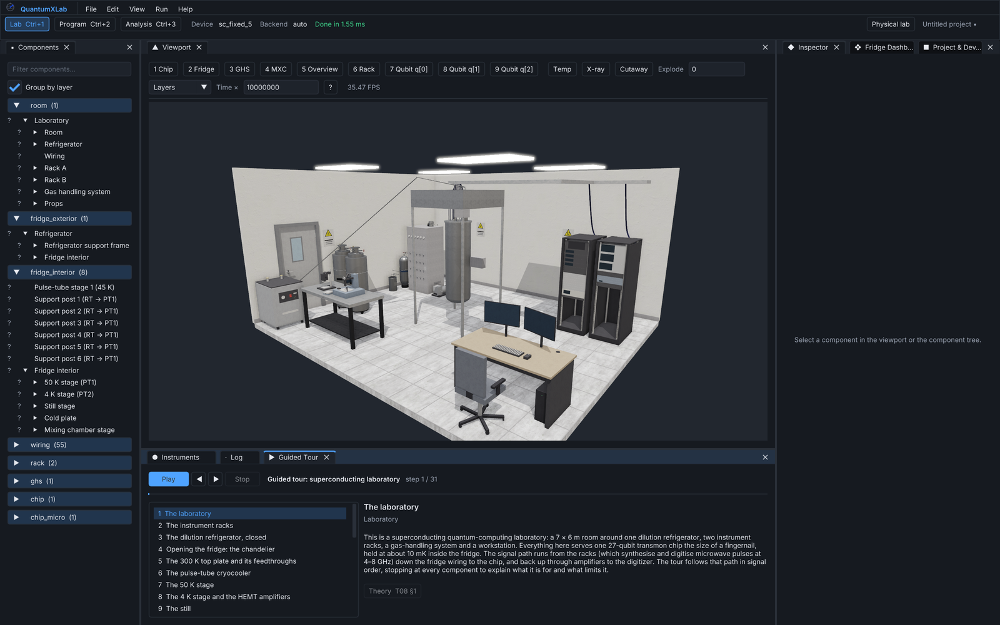
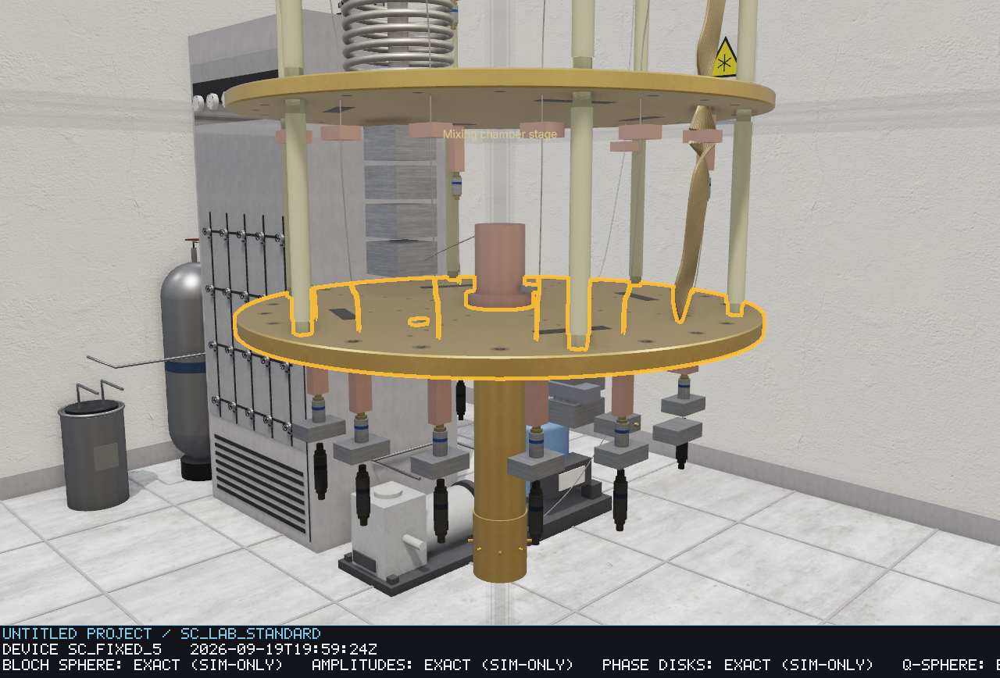
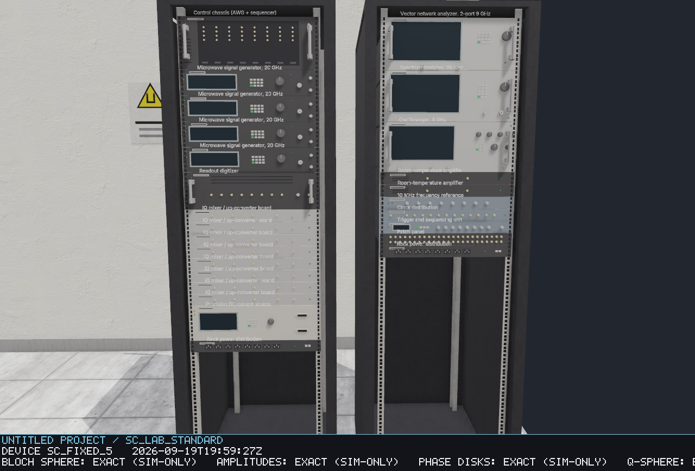
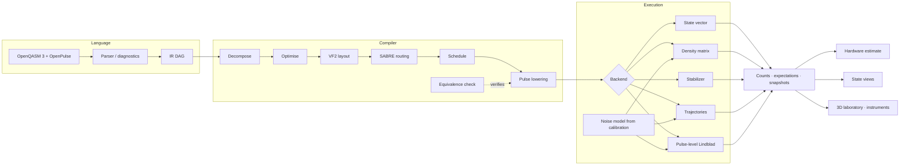
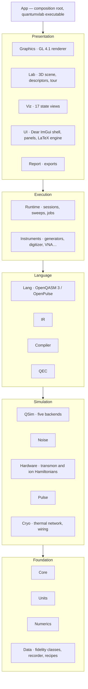
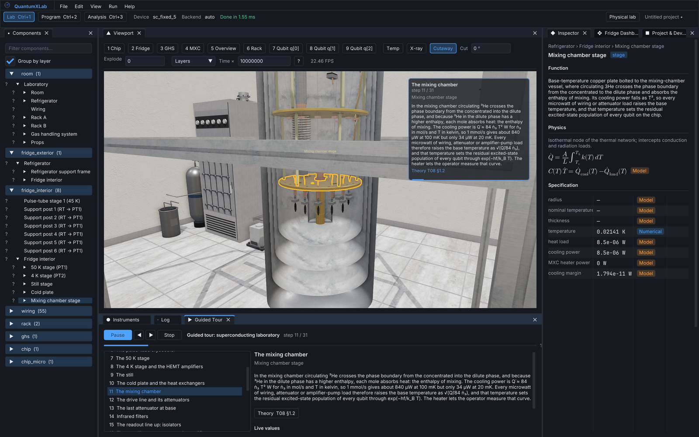
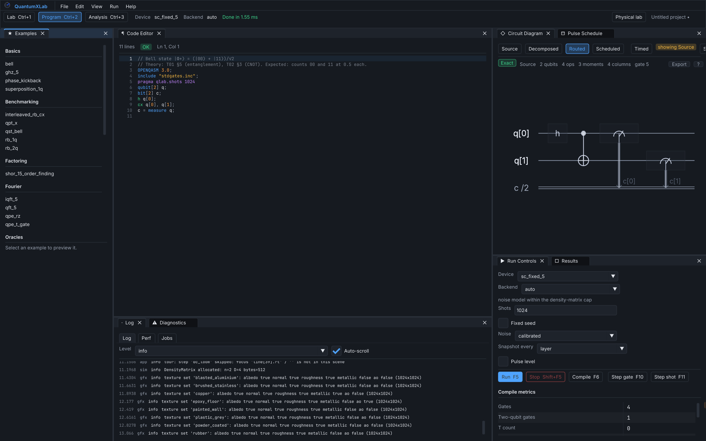
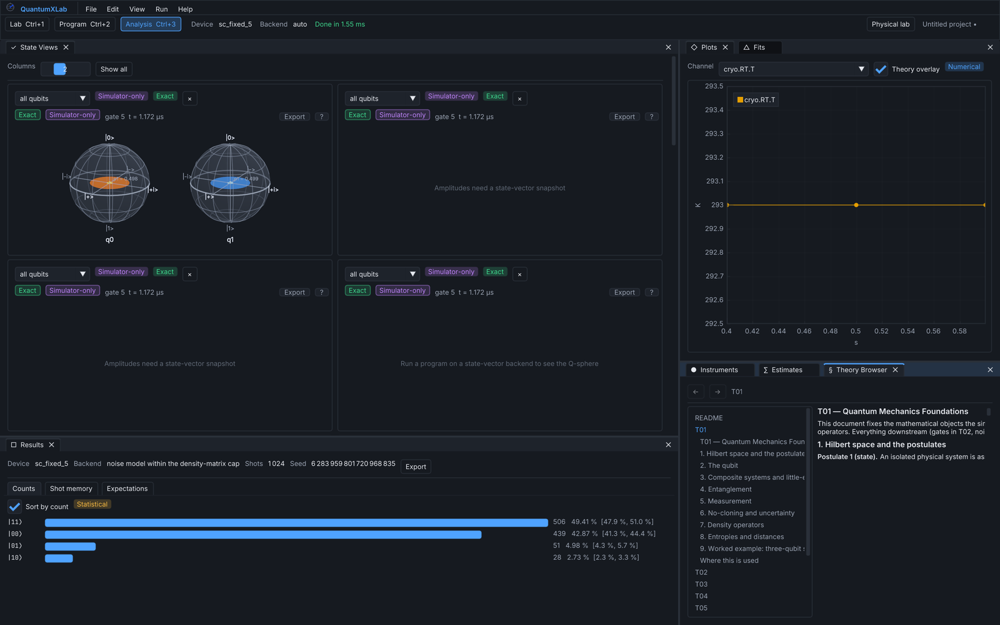

<p align="center">
  
</p>

<h1 align="center">QuantumXLab</h1>

<p align="center">
  A desktop quantum-computing research laboratory: an OpenQASM 3 / OpenPulse compiler, five numerically exact simulators with calibration-derived noise, a hardware run-time estimator, and a fully explorable 3D dilution-refrigerator lab — in C++23 and OpenGL.
</p>

<p align="center">
  
  
  
  
</p>

<p align="center">
  
</p>

---

## What it is

Most quantum-computing simulators give you a state vector and a histogram. QuantumXLab gives you the **machine**: you write a program, it is compiled onto a virtual processor exactly as it would be on real hardware (decomposition, layout, routing, scheduling, pulse lowering), executed on a simulator whose noise is derived from that processor's calibration file, and estimated for wall time and fidelity on the physical device — while a 3D model of the laboratory shows every plate of the dilution refrigerator, every coaxial line, attenuator and amplifier, and the chip down to individual qubits and Josephson junctions, each one clickable, explained, and reading live values off the running simulation.

Every number the application shows carries a **fidelity class** — *Exact*, *Numerical*, *Statistical*, *Model* or *Illustrative* — so you always know whether you are looking at a closed-form result, a converged integration, a sampled estimate with its confidence interval, a parametrised model, or a picture drawn to help intuition.

## Highlights

- **Compiler.** OpenQASM 3 with OpenPulse `cal`/`defcal` blocks and `pragma qlab.*` directives → IR DAG → decomposition to the native gate set → optimisation → VF2 layout → SABRE routing → ASAP/ALAP scheduling → pulse lowering, with an equivalence checker that proves the compiled circuit matches the source.
- **Simulators.** State vector, density matrix, stabilizer (Aaronson–Gottesman), Monte-Carlo trajectories, and a pulse-level Lindblad integrator that evolves the actual control pulses on a multi-level transmon or trapped-ion Hamiltonian (Duffing, cross-resonance, DRAG, Mølmer–Sørensen, dispersive readout).
- **Noise from calibration.** T₁, T₂, gate errors, readout assignment, thermal population and drift come from the device's calibration JSON, not from hand-set constants.
- **Six virtual processors.** `sc_fixed_5`, `sc_heavyhex_27`, `sc_heavyhex_127`, `sc_tunable_grid_54` (superconducting) and `ion_chain_11`, `ion_chain_32` (trapped ions), each with device, calibration, wiring and pulse-library files.
- **Estimator.** Wall time and fidelity on the physical machine with every assumption stated, plus surface-code resource estimates for a target logical error rate.
- **Error correction.** Surface code with a union-find decoder (measured threshold 0.56 % circuit-level), repetition and Steane codes, a stabilizer tableau simulator.
- **The 3D laboratory.** A 2 200-node scene: the dilution refrigerator as a Bluefors-class chandelier (gold-plated plates with bolt circles and chamfers, support posts, pulse-tube stages, still, heat exchangers, mixing chamber, flanged cans), the full signal chain, instrument racks with real front panels, the gas-handling system, the chip package and the chip itself. Image-based lighting, ambient occlusion, soft shadows, bloom, CC0 PBR textures.
- **Instruments.** Working models of the microwave generators, AWG, digitizer, VNA, spectrum analyser, oscilloscope and thermometry, each producing the trace a physical instrument would from the modelled signals.
- **Seventeen state views.** Bloch spheres, amplitudes, phase disks, Q-sphere, density-matrix city, entanglement graph, circuit and pulse-schedule diagrams and more, each labelled with its fidelity class.
- **Guided tour.** A narrated fly-through (31 stops for the superconducting lab, 16 for the ion trap) in signal order — racks, fridge, stage by stage to the chip and the qubits, back up the readout chain — with the physics, the live numbers and a link to the theory document at every stop.
- **Theory corpus.** Twelve LaTeX documents deriving every model in the application, rendered in-app in Latin Modern Math and cross-referenced from every component.

<table>
<tr>
<td></td>
<td></td>
</tr>
<tr>
<td align="center"><sub>The mixing-chamber stage: gold-plated plates, support posts, clamps, attenuators and the cold finger.</sub></td>
<td align="center"><sub>Every rack instrument carries its real front panel — screens, keypads, knobs, connectors, LEDs, nameplates.</sub></td>
</tr>
</table>

## How it fits together



The code is organised in strict layers; a lower layer never includes a higher one, and nothing below the presentation layer touches OpenGL or the UI toolkit (a lint enforces both rules).



## Getting started

**Requirements:** CMake ≥ 3.28, Ninja, a C++23 compiler (AppleClang 21, Clang 17+, GCC 13+), OpenGL 4.1. Dependencies (GLFW, GLM, Dear ImGui, ImPlot, FreeType, spdlog, Catch2) are fetched and pinned automatically on first configure. Developed and verified on macOS (Apple silicon); Linux and Windows builds are set up in CI.

```bash
git clone https://github.com/essam-tobgi-dev/QuantumXLab.git
cd QuantumXLab
cmake --preset debug
cmake --build --preset debug -j10
ctest --preset debug                      # the full oracle suite (≈ 6 minutes)
./build/debug/bin/quantumxlab             # the laboratory
```

For a fast, optimised binary use `cmake --preset release && cmake --build --preset release -j10`.

### Headless use

```bash
# compile and run a program, print counts, expectation values and the hardware estimate
quantumxlab --run Assets/Programs/Examples/Basics/bell.qasm --device sc_fixed_5 --shots 4096 --seed 1

# the same as a JSON document, estimate included
quantumxlab --run Assets/Programs/Examples/Search/grover_3.qasm --json

# render every workspace and camera bookmark to PNG, then check all 30 shipped examples
quantumxlab --selftest out/
```

| Option | Meaning |
|---|---|
| `--run <program.qasm>` | headless: parse → compile → run → report |
| `--device <id>` | `sc_fixed_5`, `sc_heavyhex_27`, `sc_heavyhex_127`, `sc_tunable_grid_54`, `ion_chain_11`, `ion_chain_32` |
| `--shots N`, `--seed S` | shots, and the seed every statistical result is reproducible from |
| `--backend <kind>` | `auto`, `statevector`, `densitymatrix`, `stabilizer`, `lindblad` |
| `--ideal` | run without the calibration-derived noise model |
| `-O0`, `-O1`, `-O2` | compiler optimisation level (default `-O1`) |
| `--json` | print the run-result document instead of the human-readable report |
| `--selftest <dir>` | headless render and example check; exits non-zero on a failure |
| `--layout <id>` | laboratory layout (`sc_lab_standard`, `ion_lab_11`) |
| `--physical-lab` | start with the *Physical lab* toggle on (hides everything a real machine could not show) |
| `--assets <dir>` | asset root; otherwise the compiled-in `Assets/` directory |

Anything the command line does not pin is taken from the program's own `pragma qlab.*` directives, so a program carries its own reproducible run configuration.

## Writing a program

```qasm
// Bell state |Φ+⟩ = (|00⟩ + |11⟩)/√2
OPENQASM 3.0;
include "stdgates.inc";
pragma qlab.shots 1024
pragma qlab.device sc_fixed_5
qubit[2] q;
bit[2] c;
h q[0];
cx q[0], q[1];
c = measure q;
```

`pragma qlab.*` directives set shots, device, backend, noise, optimisation level, parameter sweeps (`sweep`), randomised-benchmarking runs (`rb`), pulse-level execution (`pulse_level`), simulator probes (`probe`) and assertions on the result (`assert`). Pulse-level programs use OpenPulse:

```qasm
defcalgrammar "openpulse";
pragma qlab.pulse_level on
cal { extern port d0; frame df0 = newframe(d0, 4.8e9, 0.0); }
defcal x $0 { play(df0, drag(0.2795, 40ns, 10ns, 0.18)); }
```

Thirty worked examples ship in `Assets/Programs/Examples` — basics, Fourier transforms and phase estimation, Grover search, Shor's order finding, oracles, teleportation and protocols, VQE and QAOA, randomised benchmarking and tomography, error-correction codes, and pulse-level calibration experiments — each with an expectation file the self-test checks it against.

## Exploring the laboratory

<p align="center">
  
</p>

| Input | Action |
|---|---|
| Drag | orbit around the point under the cursor |
| Right-drag / Shift-drag | pan |
| Wheel | zoom toward the cursor |
| Alt-drag | look around |
| `W A S D Q E` | fly (speed follows the distance to what you are looking at) |
| Hover | the part's explanation card: what it is, its purpose, the physics, its live values |
| Click / double-click | inspect in the Inspector / fly to it |
| Right-click | open or close the cans, cutaway, X-ray, exploded stages, fly to, theory |
| `1`–`9` | camera bookmarks: Chip, Fridge, GHS, MXC, Overview, Rack, one per qubit |
| `C` `X` `E` `T` | cutaway · X-ray · explode the stages · open the theory of the hovered part |

`Ctrl+1/2/3` switch between the **Lab**, **Program** and **Analysis** workspaces; `F5` runs the program in the editor, `F6` compiles it, `F10`/`F11` step by gate or by shot. The **Guided Tour** panel plays the narrated fly-through; the **Temp** chip colours the stages by their live temperature; the **Physical lab** toggle hides every simulator-only view.

<table>
<tr>
<td></td>
<td></td>
</tr>
<tr>
<td align="center"><sub>Program: editor with diagnostics, circuit and pulse-schedule diagrams, run controls and results.</sub></td>
<td align="center"><sub>Analysis: state views, plots and fits, the theory browser.</sub></td>
</tr>
</table>

## Physics and theory

The models are derived, not asserted. `docs/theory` holds twelve documents with the equations the code implements, in LaTeX, and every component and equation in the application links back to its section:

| | |
|---|---|
| T01 Quantum Mechanics Foundations | T07 Control Electronics and Signals |
| T02 Gates and Circuits | T08 Cryogenics |
| T03 Quantum Algorithms | T09 Quantum Error Correction |
| T04 Open Quantum Systems and Noise | T10 Benchmarking, Tomography and Calibration |
| T05 Superconducting Qubits | T11 Simulation Numerics |
| T06 Trapped-Ion Qubits | T12 Runtime and Resource Estimation |

Conventions used throughout: little-endian qubit order, squared state fidelity, depolarising parameter *p = d·r/(d−1)*, qubit Hamiltonian *H = −½ħωZ* with |0⟩ the ground state.

## Testing

The tests are physics oracles with stated tolerances, not smoke tests: gate decompositions are checked against their unitaries, the surface-code decoder's threshold is measured against the literature value, the Mølmer–Sørensen gate is integrated from the ion Hamiltonian and must produce a Bell state and return the motional mode to its ground state, the estimator must reproduce worked examples, the renderer's lighting is checked pixel-by-pixel against analytic expectations, and the interface is driven headlessly through Dear ImGui's input queue.

```bash
ctest --preset debug                 # 793 cases, 1 242 339 assertions
python3 tools/check_includes.py      # layering rules
python3 tools/check_xrefs.py         # every theory cross-reference resolves
python3 tools/gen_assets.py          # regenerate the generated assets (must reproduce them)
```

Component descriptors, device files, recipes and the language tables under `Assets/` are generated by `tools/gen_assets.py`; edit the tables there, not the JSON.

## Repository layout

```
src/            21 modules, one directory each (Core … App)
tests/          Catch2 suites, one per module
Assets/         programs, devices, calibrations, lab layouts and descriptors, tours,
                shaders, textures, fonts, theory corpus
docs/theory/    the twelve theory documents
tools/          asset generator, lints
third_party/    nlohmann/json, stb
```

## Credits and licences

QuantumXLab is released under the MIT License (see `LICENSE`).

Third-party components: Dear ImGui and ImPlot (MIT), GLFW (zlib), GLM (MIT), FreeType (FTL), spdlog (MIT), Catch2 (BSL-1.0), nlohmann/json (MIT), stb (MIT/public domain). Fonts: Inter and JetBrains Mono (SIL OFL 1.1), Latin Modern Math (GUST Font License). Textures: CC0 sets from ambientCG, listed with their sources in `Assets/Textures/SOURCES.md`.
